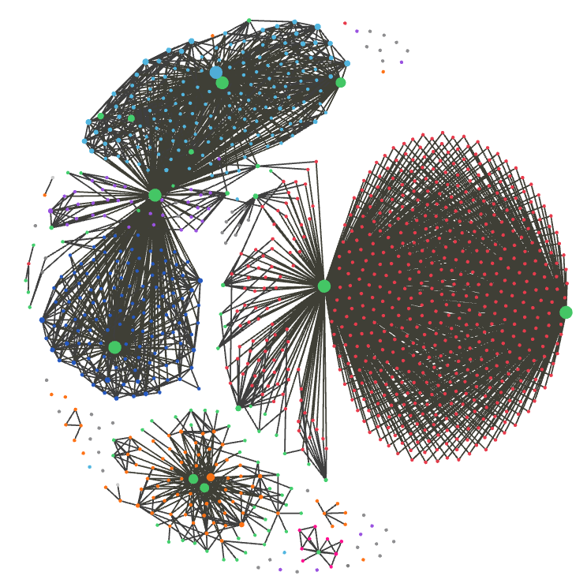
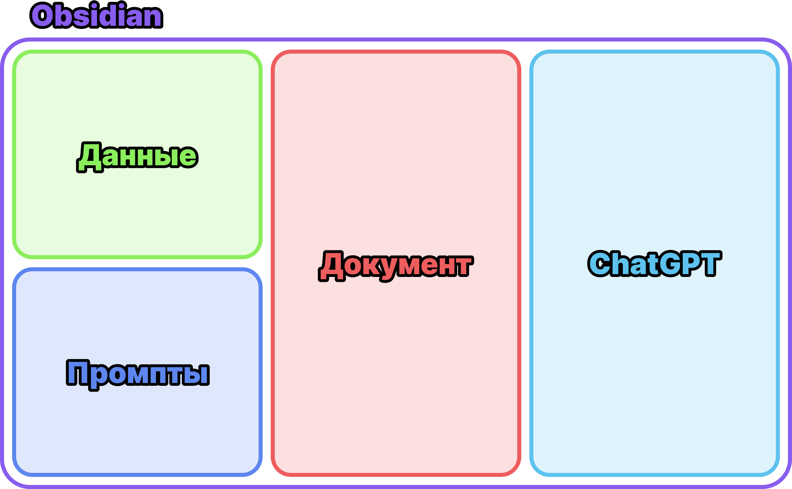

# Коротко об Obsidian

Obsidian — приложение для организации личной базы знаний, которая хранится локально на вашем ПК в виде текстовых файликов. Заметки можно связывать друг с другом ссылками и тегами, вставлять в них изображения и видео, и оформлять всё это используя разметку [Markdown](https://ru.wikipedia.org/wiki/Markdown).

Короче говоря, это ваша личная википедия, которая позволяет хранить и структурировать любые данные. В моём случае она выглядят так:

Само собой, вокруг такого сразу хочется обернуть нейронку! Чтобы вся эта красота работала не только как память, но и как интеллект.

# Боль в ChatGPT

При работе с ChatGPT возникает масса проблем. Официальный клиент страшно лагает, чаты с длинной перепиской иногда просто вешают браузер. А при большом количестве чатов, их список быстро превращается в помойку.

И главная проблема — данные, с которыми вы работаете, хранятся отдельно от чата, и постоянно приходится копировать тексты туда-обратно (частично эту проблему решает режим "Canvas", но и он тоже кривой). А ведь ещё где-то нужно хранить промпты. Жуть!

Поэтому идея в том, чтобы засунуть всё это в один интерфейс. Схематично он будет выглядеть так:

# Плюсы

- Obsidian легковесный и работает очень быстро. Ещё он бесплатный, и доступен на всех платформах, включая мобильные, а организовать синхронизацию или командную работу можно черел любой облачный сервис.
- Промпты и данные из библиотеки вставляются в чат нажатием пары клавиш.
- Сложные промпты приводят к накоплению ошибок, но можно разделить их на более простые, выдающие стабильные результаты — а затем объединить в супер-промпт.
- В плагин можно подключить локальную модель, которая будет работать бесплатно и оффлайн.
- Можно проиндексировать вашу базу, и скормить нейронке вообще весь контекст который у вас есть.

# Минусы

- Работа через API стоит денег. Впрочем, цены очень доступные даже для топовых моделей, а для рабочих задач можно попросить ключ у Влада.
- Плагин не умеет искать информацию в интернете, принимать файлы в качестве аттачей, и выдавать результаты в виде файлов. Разработчик обещает это всё допилить, но когда это случится, и сколько будет стоить — пока непонятно.
- Вероятно, вам захочется засунуть в базу вообще всё (это нормально, просто берегите своё время).

# [2. Установка](2.%20Установка.md)
