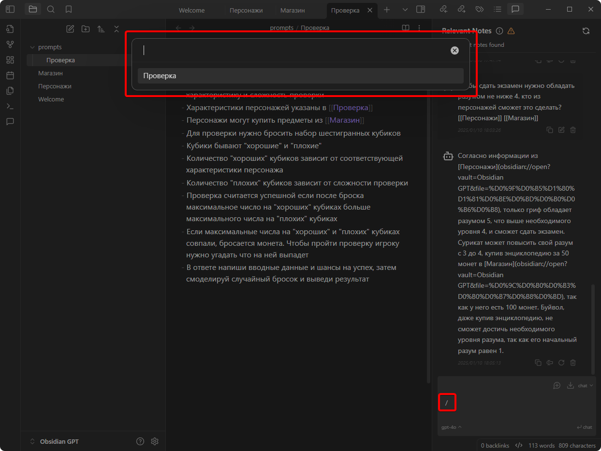
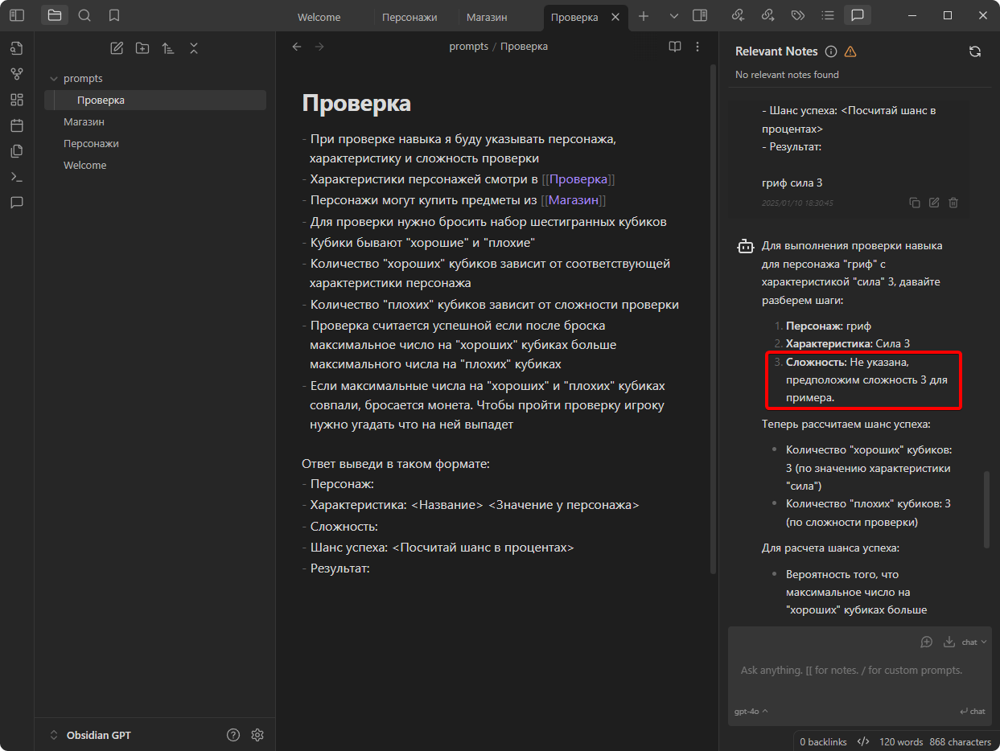

# Контекст

Теперь добавим в нашу базу какие-то данные. Например, мы делаем настольную ролевую игру. Создаём заметку описанием персонажей:

Если задать чату вопрос
> [!summary] Промпт
> кто сильнее — гриф или сурикат?

он справедливо сообщит что это слишком разные животные для сравнения:

Чтобы добавить ему контекст, в тексте промпта нужно указать название заметки в двойных квадратных скобках:
> [!summary] Промпт
> кто сильнее — гриф или сурикат? [[Персонажи]]

Усложним задачу. Заводим ещё одну заметку с табличкой ассортимента товаров в магазине, и указываем ссылки на обе заметки:
> [!summary] Промпт
> чтобы сдать экзамен нужно обладать разумом не ниже 4. кто из персонажей сможет это сделать? [[Персонажи]] [[Магазин]]

# Промпты

Теперь добавим в нашу базу промпты, чтобы не вводить их каждый раз вручную. Создаём папку "prompts", а внутри неё заметку "Проверка", в которой описываем правила проверки навыка для нашей игры:

Чтобы подключить папку с промптами, открываем настройки плагина и указываем путь к нашей папке:

Закрываем настройки, вводим в чате "/" и видим что наш промпт появился в списке:

Нажимаем Enter, видим что в поле ввода скопировался весь текст промпта, и дописываем параметры. То есть фактически мы ввели:
> [!summary] Промпт
> /Проверка гриф сила 3

Видим что ChatGPT не смог распознать параметр "Сложность" который мы ему передали. Ещё бывает что он не находит характеристику персонажа. Так бывает когда запрос оказывается слишком сложным:

Чтобы это исправить, откроем настройки плагина. В нём есть две настройки:
- Temperature — в этом случае её можно уменьшить до нуля, поскольку нам требуется точный ответ
- Token limit — её можно увеличить, чтобы разрешить модели использовать больше своих мозгов. Но учтите, что чем больше токенов — тем дороже запрос

Нажмём кнопку для получения нового ответа:

Теперь модель всё поняла правильно:

# Супер-промпты

Заведём ещё один промпт, который будет придумывать художественную часть проверок, генерируя описание ситуации, в которую попал персонаж, действия игрока, и результат:

Проверяем с параметрами, которые могли бы получить в результате проверки навыка:

> [!summary] Промпт
> /Ситуация буйвол, разум 2, провал

А теперь соединим промпты проверки и описанием! Создаём новый промпт, в котором ссылаемся на два других промпта. Теперь можно выполнить:
> [!summary] Промпт
> /Событие сурикат, харизма, сложность 7

Сначала смоделируется проверка навыка, потом её резуальтат передастся промпту для описания, а потом это описание ещё и будет переведено на английский:

Ну круто же?

# Но вы не обольщайтесь

К сожалению это работат совсем не идеально.

Во-первых, нейронка может начать врать и придумывать там, где нужен точный ответ. В нашем примере он иногда всё-таки путает входные параметры, неверно считает шансы успеха, выводит ответ не полностью, или не соблюдает формат. Справиться с этим можно двумя способами:
1. Делать мелкие промпты, и экспериментировать с инструкциями в них, чтобы получать стабильные ответы на разных данных. А затем объединять их в супер-промпт.
2. Тюнить настройки "Temperature" и "Token limit" под конкретную задачу. К сожалению, изменить эти параметры можно только для всего плагина (а было бы удобно иметь возможность указывать их в тексте промпта). Поэтому придётся выбрать средние значения подходящие для ваших задач, либо постоянно лазить в опции. Впрочем, для разных баз знаний можно завести разные хранилища, и настроить в них плагины отдельно.

Во-вторых, модель придумывает довольно скудные сюжеты: в двадцати генерациях Сурикат либо танцевал, либо рассказывал анекдоты на деревенской площади. Но результат можно улучшить, если сообщить ему больше деталей.

# [4. Локальные модели](4.%20Локальные%20модели.md)

