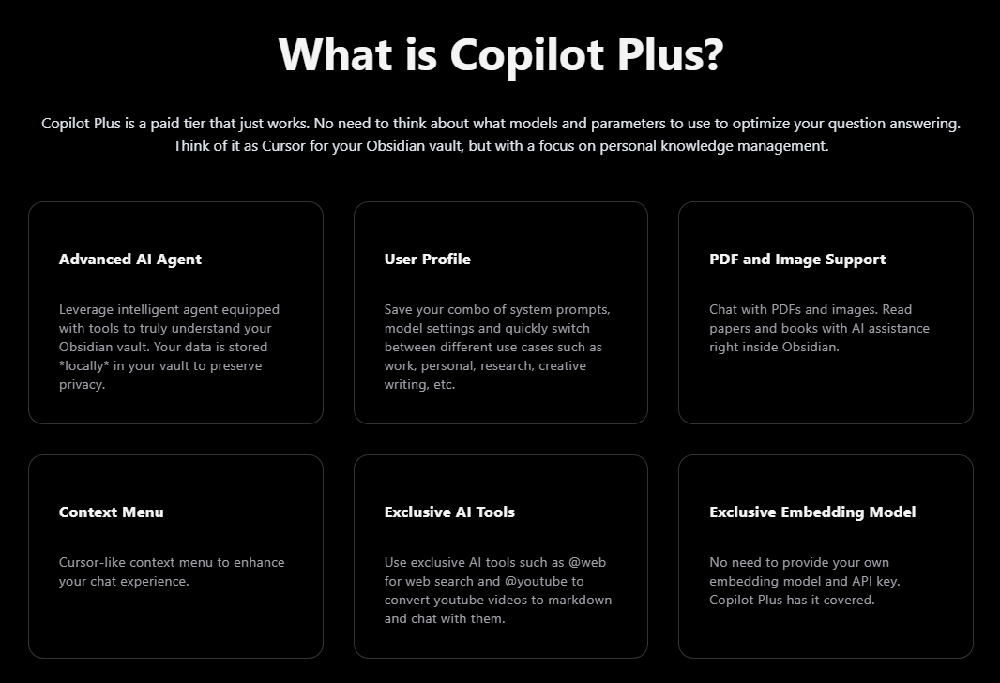
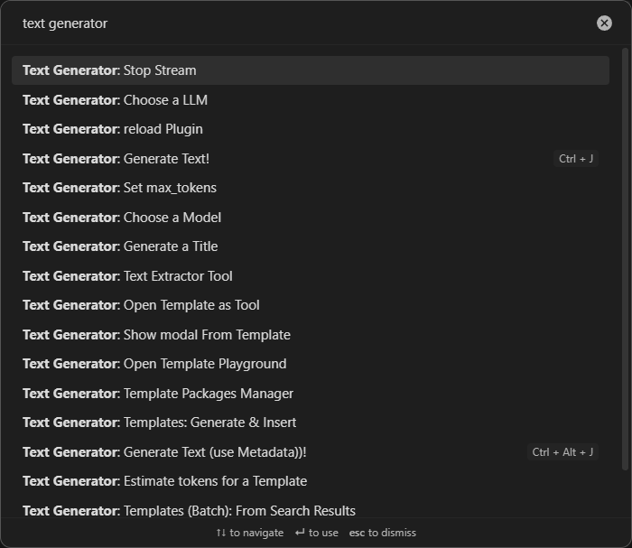
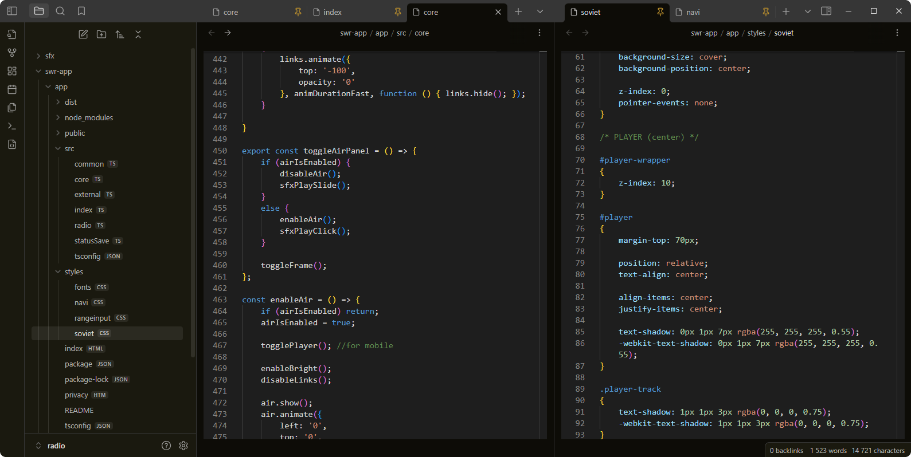
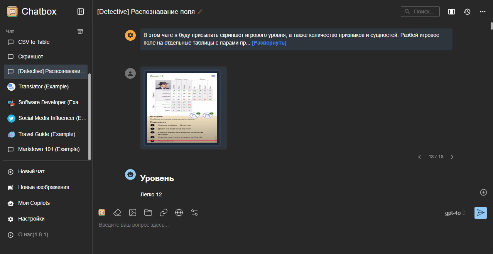

### Copilot Plus

Разработчик плагина Copilot обещает добавить платную подписку, в которой будут реализованы вот такие фичи:

Пока доступна только запись в лист ожидания, см. https://www.obsidiancopilot.com

---

### Text Generator

Ещё один полезный плагин для Obsidian, позволяет работать с текстом прямо внутри заметки, а не в отдельной панели с чатом.

Я с ним пока не разбирался, но он тоже умеет подключать разные модели, и предлагает вот такой список команд:

---

### VSCode Editor

Плагин, который будет полезен программистам — позволяет отображать и редактировать любые текстовые файлы (список расширений указывается в настройках). Подсветка синтаксиса присутствует:

---

### Chatbox
https://chatboxai.app

Сторонний клиент для ChatGPT, который также подключается через API, и работает шустрее нативного клиента.
- Позволяет задавать и менять промпт для всего чата, что достаточно удобно.
- Поддерживает загрузку файлов, например можно распознавать картинки.
- Не поддерживает их скачивание, поэтому сконвертировать файл в какой-то другой формат не получится. Голосовые фишки также недоступны.
- Есть standalone-приложение и web-версия (правда в ней у меня почему-то постоянно отваливается ключ).

---

### Спасибо за внимание ✌️